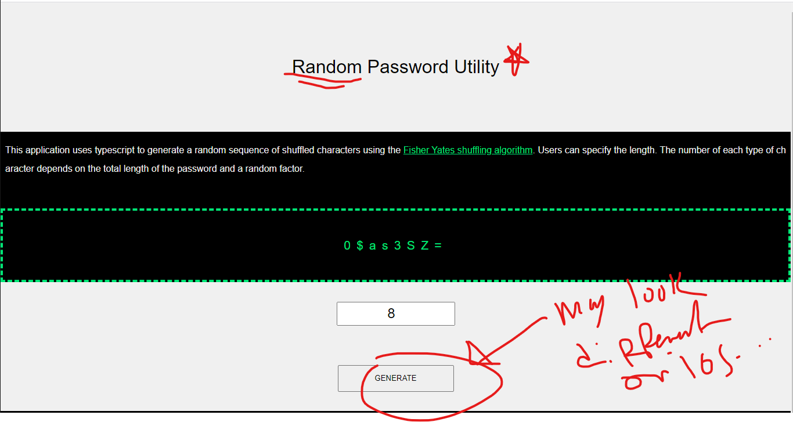

https://luigicampbell.github.io/overwrought-password-generator/
# overwrought-password-generator
A typescript based password generator app

### What does this do?
If you're tired of writing out crazy passwords, consider generating one from **upper and lower case letters**, **numbers**, and **special characters**.

### How does it do?
The process involves selecting a minimum number of characters from each subset of characters (upper case, lower case, numbers, and the **other** characters) then filling in the remaining slots with random characters from random subsets.
Ultimately, the characters are shuffled and then printed on the screen.

### to run typescript locally
run this command in bash: `tsc -w --downlevelIteration *.ts`

Demo: 
